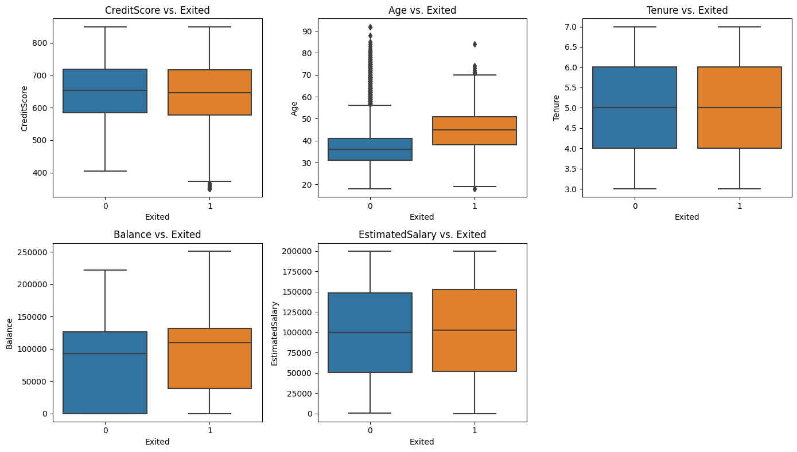
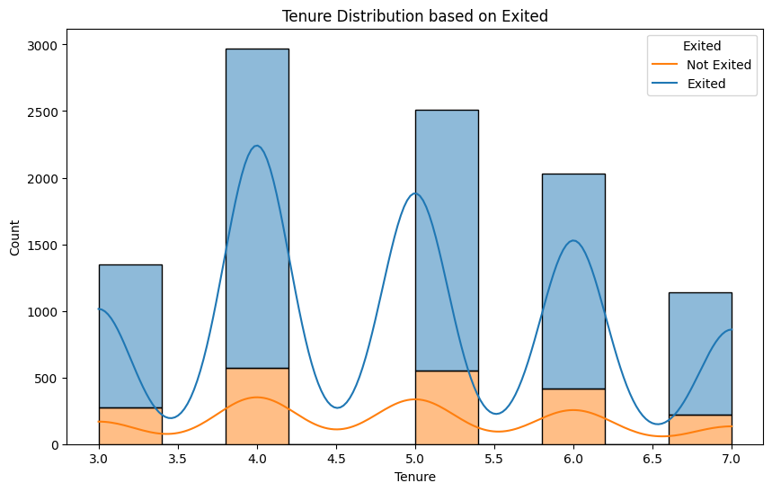
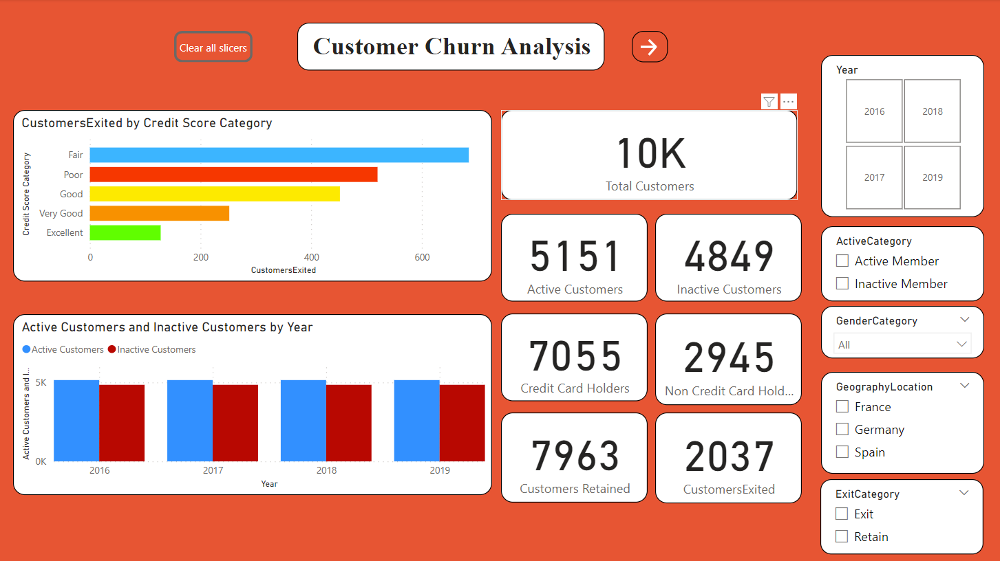
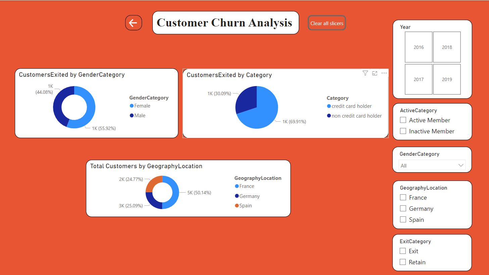
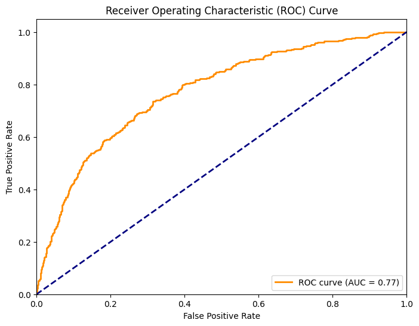
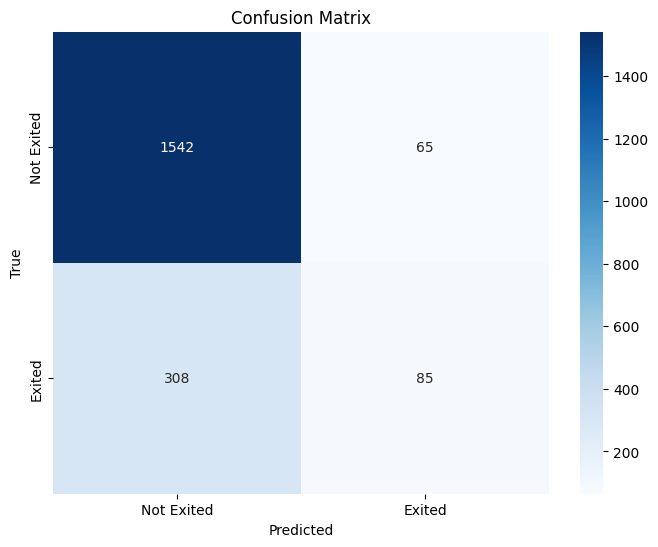
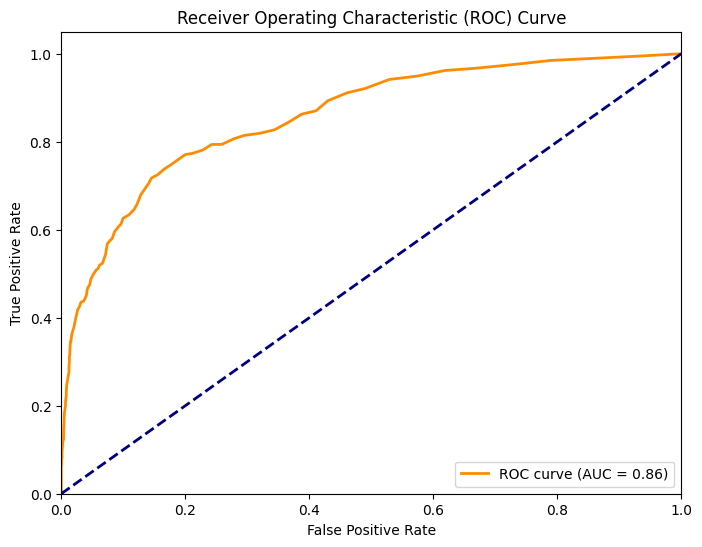
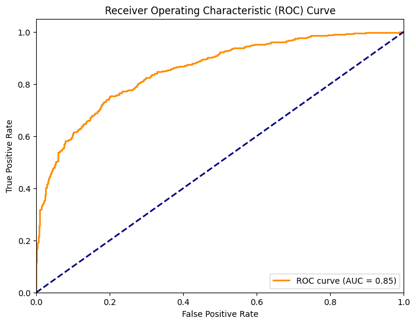
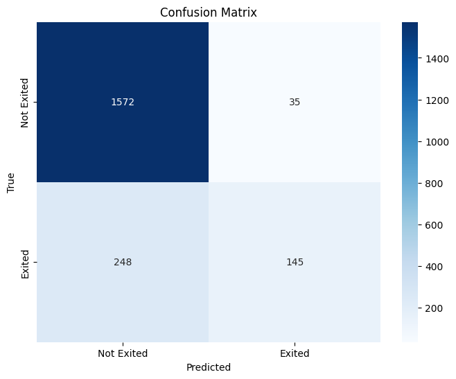

# Customer Churn Prediction and Data Analysis
"Customer Churn Prediction and Data Analysis" involves comprehensively assessing customer data to predict and understand instances of customer churn, where individuals discontinue their use of a product or service. Through data collection, cleaning, and visualization, important patterns and correlations are uncovered. Utilizing machine learning models like logistic regression, decision trees, random forests, or support vector machines, the aim is to predict future churn cases with a high level of accuracy. The process includes model evaluation, interpretation of features driving churn, and generating actionable recommendations for business strategies. The goal is to enhance customer retention by leveraging insights from predictive analytics and continuous monitoring of model performance in real-world scenarios.

# Implementation Overview

1.Exploratory Data Analysis (EDA):

Data Inspection: Began with a preliminary inspection of the dataset to understand the type, amount, and nature of data available.

Visual Analysis: Plotted various graphs like histograms, bar plots, and heatmaps to visually interpret data distributions, correlations, and patterns.

2.Data Preprocessing and Cleaning:

Handling Missing Values: Identified and dealt with any missing values in the dataset, either by imputation or removal.

Normalization and Scaling: Scaled numerical features to ensure all features contribute equally to model performance.

3.Model Application:

Applied four primary machine learning algorithms to predict churn:

Logistic Regression

Decision Trees

Random Forest

Support Vector Machine (SVM)

4.Ensemble Modeling:

Created a robust ensemble model that combined predictions from all four individual models. This was done to leverage the strengths of each algorithm and improve overall prediction accuracy.

5.Model Evaluation:

Training & Testing Split: Split the data into training and testing subsets to evaluate model performance.

Performance Metrics: Evaluated model performance using metrics such as accuracy, precision, recall, F1-score, and the ROC curve.

6.ETL Process for KPI Identification:

Extraction: Sourced data from original databases or files.

Transformation: Processed the data to derive valuable Key Performance Indicators (KPIs) relevant for understanding churn.

Loading: Stored the transformed data in a structured manner suitable for reporting and visualization.

7.Power BI Dashboards:

Data Integration: Integrated the cleaned and processed data into Power BI.

Visualization: Created interactive dashboards in Power BI to visually represent 
churn-related KPIs and insights. The dashboards allow stakeholders to dynamically explore different facets of customer churn.

# Results

Accuracy
<pre>
            Logistic Regression   Random Forest    XGBoost     SVM     Ensemble Model
Python             81.35%            86.10%        85.85%     85.85%      86.40%
R                  80.80%            86.35%        85.30%     85.95%      86.60%

</pre>

## Logistic Regression

## Random Forest

## XGBoost

## SVM

## Ensemble Model

